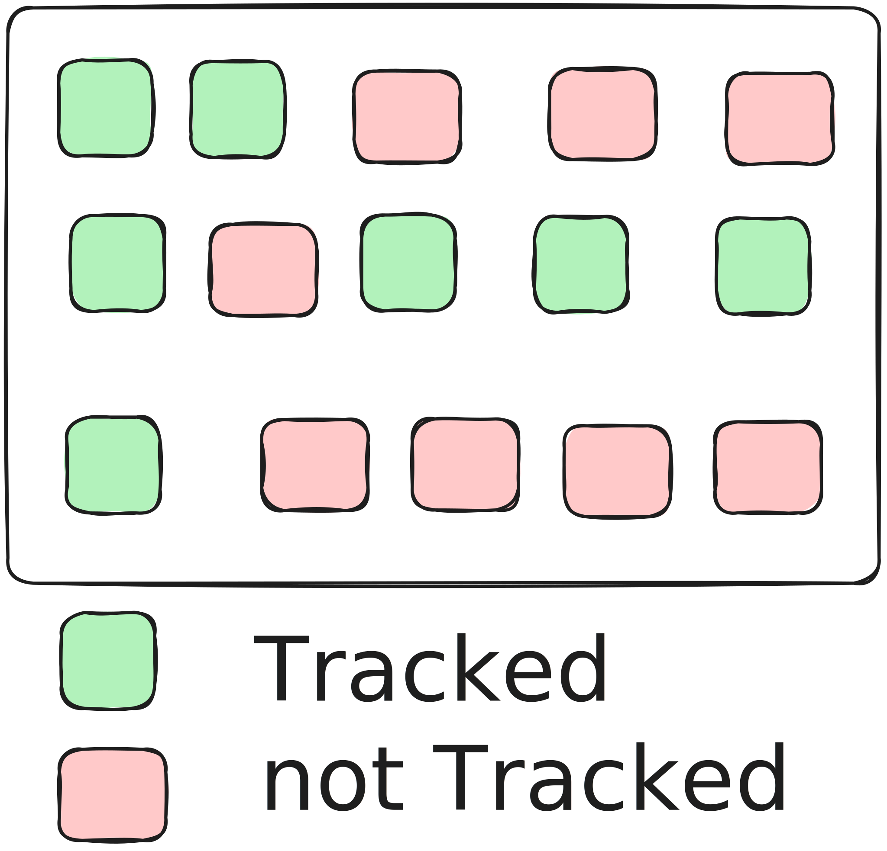
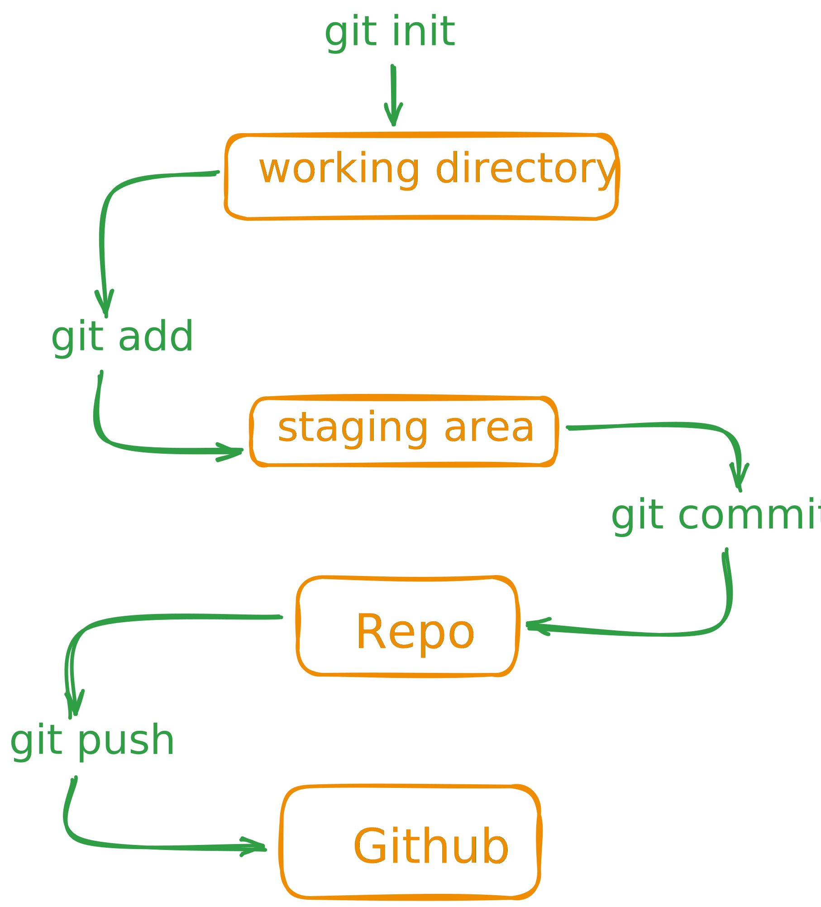

Git and people who use it talk in a different terminology. For example they don’t call it a folder, they call it a repository. They don’t call it alternative timeline, they call it branch. Although, I agree that alternative timeline is a better name for it. 😁


## Check your git version

To check your git version, you can run the following command:

Terminal window

```
git --version
```

This command will display the version of git installed on your system. Git is a very stable software and don’t get any breaking changes in majority of the cases, at least in my experience.

## Repository

A repository is a collection of files and directories that are stored together. It is a way to store and manage your code. A repository is like a folder on your computer, but it is more than just a folder. It can contain other files, folders, and even other repositories. You can think of a repository as a container that holds all your code.

There is a difference between a software on your system vs tracking a particular folder on your system. At any point you can run the following command to see the current state of your repository:

Terminal window

```
git status
```



Not all folders are meant to be tracked by git. Here we can see that all green folders are projects are getting tracked by git but red ones are not.

## Your config settings

Github has a lot of settings that you can change. You can change your username, email, and other settings. Whenever you checkpoint your changes, git will add some information about your such as your username and email to the commit. There is a git config file that stores all the settings that you have changed. You can make settings like what editor you would like to use etc. There are some global settings and some repository specific settings.

Let’s setup your email and username in this config file. I would recommend you to create an account on github and then use the email and username that you have created.

Terminal window

```
git config --global user.email "your-email@example.com"git config --global user.name "Your Name"
```

Now you can check your config settings:

Terminal window

```
git config --list
```

This will show you all the settings that you have changed.

## Creating a repository

Creating a repository is a process of creating a new folder on your system and initializing it as a git repository. It’s just regular folder to code your project, you are just asking git to track it. To create a repository, you can use the following command:

Terminal window

```
git statusgit init
```

`git status` command will show you the current state of your repository. `git init` command will create a new folder on your system and initialize it as a git repository. This adds a hidden `.git` folder to your project.

## Commit

commit is a way to save your changes to your repository. It is a way to record your changes and make them permanent. You can think of a commit as a snapshot of your code at a particular point in time. When you commit your changes, you are telling git to save them in a permanent way. This way, you can always go back to that point in time and see what you changed.

Usual flow looks like this:


## Complete git flow

A complete git flow, along with pushing the code to github looks like this:



When you want to track a new folder, you first use `init` command to create a new repository. Then you can use `add` command to add the folder to the repository. After that you can use `commit` command to save the changes. Finally you can use `push` command to push the changes to github. Of course there is more to it but this is the basic flow.

## Stage

Stage is a way to tell git to track a particular file or folder. You can use the following command to stage a file:

Terminal window

```
git initgit add <file> <file2>git status
```

Here we are initializing the repository and adding a file to the repository. Then we can see that the file is now being tracked by git. Currently our files are in staging area, this means that we have not yet committed the changes but are ready to be committed.

## Commit

Terminal window

```
git commit -m "commit message"git status
```

Here we are committing the changes to the repository. We can see that the changes are now committed to the repository. The `-m` flag is used to add a message to the commit. This message is a short description of the changes that were made. You can use this message to remember what the changes were. Missing the `-m` flag will result in an action that opens your default settings editor, which is usually VIM. We will change this to vscode in the next section.

## Logs

Terminal window

```
git log
```

This command will show you the history of your repository. It will show you all the commits that were made to the repository. You can use the `--oneline` flag to show only the commit message. This will make the output more compact and easier to read.

☕️ - Check git log docs

> Atomic commits are a way to make sure that each commit is a self-contained unit of work. This means that if one commit fails, you can always go back to a previous commit and fix the issue. This is important for maintaining a clean and organized history in your repository.

## change default code editor

You can change the default code editor in your system to vscode. To do this, you can use the following command:

Terminal window

```
git config --global core.editor "code --wait"
```

## gitignore

Gitignore is a file that tells git which files and folders to ignore. It is a way to prevent git from tracking certain files or folders. You can create a gitignore file and add list of files and folders to ignore by using the following command:

Example:

```
node_modules.env.vscode
```

Now, when you run the `git status` command, it will not show the `node_modules` and `.vscode` folders as being tracked by git.

## Conclusion

In this section, we have learned about the basics of git and how to use it to track changes to your files and folders. We have also learned about the different commands that you can use to interact with your repository, such as `init`, `add`, `commit`, `log`, etc By the end of this section, you should have a good understanding of how to use git and how to use it effectively to manage your code.

---


[Previous  ]()&nbsp; &nbsp; &nbsp; &nbsp; &nbsp; &nbsp; [Next ]()
