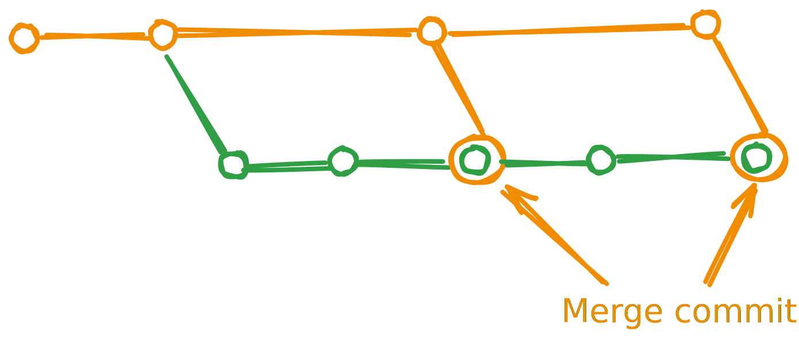
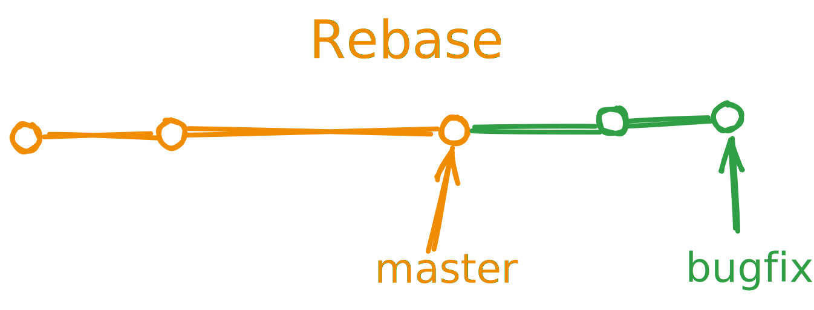

## Rebase in git

Git rebase is a powerful Git feature used to change the base of a branch. It effectively allows you to move a branch to a new starting point, usually a different commit, by “replaying” the commits from the original base onto the new base. This can be useful for keeping a cleaner, linear project history.

Some people like to use rebase over the merge command because it allows you to keep the commit history cleaner and easier to understand. It also allows you to make changes to the code without affecting the original branch.

## Merge commits

A merge commit is a commit that combines two or more commits into one. It is created when you merge two or more branches into a single branch. The merge commit contains all the changes from the original branches, and it is used to keep the project history clean and easy to understand.



## Rebase



Rebase is a powerful tool in Git that allows you to move a branch to a new starting point. It effectively replays the commits from the original base onto the new base. This can be useful for keeping a cleaner, linear project history.

Here’s a flow example of using git rebase with all the commands involved:

Suppose you have a feature branch called feature-branch that you want to rebase onto the main branch.

### Ensure you are on the branch you want to rebase:

Terminal window

```
git checkout feature-branchgit rebase main
```

This will replay the commits from feature-branch on top of the latest changes in main.

### Resolve any conflicts:

If there are any conflicts, you will need to resolve them manually. You can use the merge tool in VSCode to resolve the conflicts.

Terminal window

```
git add <resolved-files>git rebase --continue
```

> Try to avoid —force option when using rebase. It can cause issues with the project history. I have seen many horror stories of people using —force to fix conflicts.

## Git reflog

Git reflog is a command that shows you the history of your commits. It allows you to see the changes that you have made to your repository over time. This can be useful for debugging and understanding the history of your project.

### View the reflog:

Terminal window

```
git reflog
```

This will show you the history of your commits. You can use the number at the end of each line to access the commit that you want to view.

### Find specific commit

You can find a specific commit using the following command:

Terminal window

```
git reflog <commit-hash>
```

### Recover lost commits or changes

If you accidentally deleted a branch or made changes that are no longer visible in the commit history, you can often recover them using the reflog. First, find the reference to the commit where the branch or changes existed, and then reset your branch to that reference.

Terminal window

```
git reflog <commit-hash>git reset --hard <commit-hash>
```

or you can use `HEAD@{n}` to reset to the nth commit before the one you want to reset to.

Terminal window

```
git reflog <commit-hash>git reset --hard HEAD@{1}
```

## Conclusion

In this section, we have learned about the different types of merges and how to resolve conflicts. We have also learned about the importance of branching and merging in Git and Github. By the end of this section, you should have a good understanding of how to use Git and Github effectively.

[Previous diff stash and Tags](diff%20stash%20and%20Tags.md)    [Next  getting started with Github](getting%20started%20with%20Github.md)